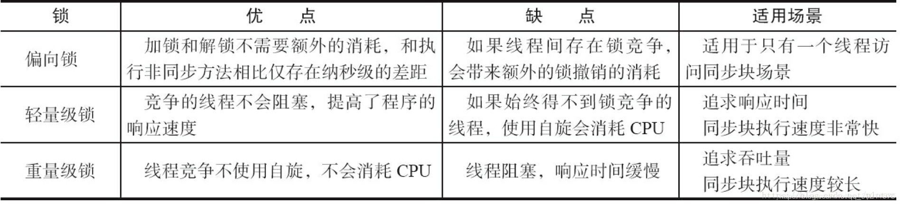

# synchronized 锁升级机制
Java的锁升级过程是一个为了提高并发性能而设计的机制，它允许JVM根据竞争情况动态地调整锁的状态。从Java 6开始，JVM对synchronized的实现进行了优化，引入了锁升级的过程，包括无锁状态、偏向锁、轻量级锁和重量级锁四种状态。

无锁状态：这是对象的初始状态，没有任何线程持有该对象的锁。

偏向锁：为了减少无竞争情况下的锁开销，JVM引入了偏向锁。当一个线程首次访问同步代码块并获取锁时，JVM会记录下这个线程ID，并将这个锁对象标记为偏向锁。这样，当这个线程再次请求同一个锁时，无需竞争，可以直接获取，从而提高了性能。

如果锁对象的Mark Word中存储的线程ID是当前线程的ID，则当前线程可以直接进入方法或代码块执行逻辑。
如果Mark Word中存储的不是当前线程的ID，则当前线程会通过CAS（Compare and Swap）自旋的方式竞争锁资源。如果成功抢占到锁，则将Mark Word中存储的线程ID修改为自己的线程ID，将偏向锁标记设置为1，锁标志位设置为01，当前锁处于偏向锁状态。
如果CAS自旋操作竞争锁失败，则说明有其他线程也在争抢锁资源。此时会撤销偏向锁，触发升级为轻量级锁的操作。
轻量级锁：当存在多个线程竞争同一个锁时，无法满足偏向锁的场景，锁会升级为轻量级锁。在轻量级锁状态下，线程通过自旋的方式尝试获取锁，避免线程的阻塞和唤醒，减少性能损失。如果自旋次数达到一定阈值或自旋时间过长仍然没有成功获取锁，则锁会升级到重量级锁。

成功获取轻量级锁的线程会将锁对象的Mark Word中的锁标志位设置为00，此时进入轻量级锁状态。
重量级锁：当自旋锁尝试一定次数后仍然无法获取锁时，锁将升级为重量级锁。在重量级锁状态下，请求锁的线程会被阻塞，等待其他线程释放锁。重量级锁会导致用户态和内核态的切换，性能开销较大。

Java锁的升级过程是一个从低级别锁到高级别锁的转换过程，旨在根据竞争情况动态地调整锁的状态，以提高并发性能。需要注意的是，锁升级过程是不可逆的，即一旦锁升级为重量级锁，就不会再恢复到轻量级锁或偏向锁状态。

# AQS的本质是什么？
AQS的本质是提供一种通用抽象，用于解决多线程环境下争用锁，如何对线程进行管理。核心方法包括：获取锁和释放锁。
AQS内部会基于一个基于双向链表实现的FIFO队列，来维护每个尝试获取锁的线程。每一个线程都会有入队和出队的过程。

在此基础上，用户可以扩展自己的逻辑，比如使用独占锁还是共享锁。或者是否要实现公平锁或非公平锁。