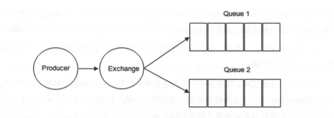

###### RabbitMQ基于生产消费者模型理念，负责接收，存储，转发消息。
###### 如果用邮局的例子来比喻，Producer是寄件人，Exchange是邮箱，Queue是负责邮递的交通工具，Consumer就是收件人。之所以叫exchange这么拗口的名字，是因为从计算机术语来讲，这种模型是一种交换机模型。

### 下面一一介绍上图中的一些概念。

###### 1.1 Producer(生产者) 和 Consumer(消费者)
- Producer(生产者)：生产消息的一方（邮件投递者）
- Consumer(消费者)：消费消息的一方（邮件收件人）
- 
  消息一般由2部分组成：消息头 （或者说是标签 Label）和 消息体 。
  
- 消息体也可以称为 payLoad ,消息体是不透明的，而消息头则由一系列的可选属性组成，这些属性包括 routing-key（路由键）、priority（相对于其他消息的优先权）、delivery-mode（指出该消息可能需要持久性存储）等。
  
- 生产者把消息交由 RabbitMQ 后，RabbitMQ 会根据消息头把消息发送给感兴趣的 Consumer(消费者)。

###### 1.2 Exchange(交换器)
- 在 RabbitMQ 中，消息并不是直接被投递到 Queue(消息队列)中的，中间还必须经过 Exchange(交换器)这一层， Exchange(交换器)会把我们的消息分配到对应的 Queue(消息队列)中。

- Exchange(交换器)用来接收生产者发送的消息并将这些消息路由给服务器中的队列中，如果路由不到，或许会返回给 Producer(生产者)，或许会被直接丢弃掉 。这里可以将RabbitMQ中的交换器看作一个简单的实体。
- RabbitMQ 的 Exchange(交换器) 有4种类型：direct(默认)，fanout，topic，和 headers。不同类型的Exchange转发消息的策略有所区别。这个会在介绍Exchange Types(交换器类型)时候介绍到。
  
- Exchange(交换器) 示意图：
 
  
- 生产者将消息发给交换器的时候，一般会指定一个RoutingKey(路由键) ，用来指定这个消息的路由规则，而这个 RoutingKey 需要与交换器类型和绑定键(BindingKey)联合使用才能最终生效 。
  
- RabbitMQ 中通过 Binding(绑定)将 Exchange(交换器)与 Queue(消息队列)关联起来，在绑定的时候一般会指定一个 BindingKey(绑定键),这样 RabbitMQ 就知道如何正确将消息路由到队列了。
  如下图所示，一个绑定就是基于路由键将交换器和消息队列连接起来的路由规则，所以可以将交换器理解成一个由绑定构成的路由表。Exchange 和 Queue 的绑定可以是多对多的关系。
  
- Binding(绑定) 示意图：
  
- 生产者将消息发送给交换器时，需要一个RoutingKey,当 BindingKey 和 RoutingKey 相匹配时，消息会被路由到对应的队列中。
  在绑定多个队列到同一个交换器的时候，这些绑定允许使用相同的 BindingKey。BindingKey 并不是在所有的情况下都生效，它依赖于交换器类型，比如fanout类型的交换器就会无视条件，而是将消息路由到所有绑定到该交换器的队列中。

###### 1.3 Queue(消息队列)
- Queue(消息队列)用来保存消息直到发送给消费者。它是消息的容器，也是消息的终点。一个消息可投入一个或多个队列。消息一直在队列里面，等待消费者连接到这个队列将其取走。
- RabbitMQ中消息只能存储在队列中，这一点和 Kafka这种消息中间件相反。Kafka 将消息存储在 topic（主题）这个逻辑层面，而相对应的队列逻辑只是topic实际存储文件中的位移标识。
- RabbitMQ 的生产者生产消息并最终投递到队列中，消费者可以从队列中获取消息并消费。
- 多个消费者可以订阅同一个队列 ，这时队列中的消息会被平均分摊（Round-Robin，即轮询）给多个消费者进行处理，而不是每个消费者都收到所有的消息并处理，这样避免消息被重复消费。
- **RabbitMQ不支持队列层面的广播消费,如果有广播消费的需求，需要在其上进行二次开发,这样会很麻烦，不建议这样做。**

###### 1.4 Broker（消息中间件的服务节点）
- 对于 RabbitMQ 来说，一个 RabbitMQ Broker 可以简单地看作一个 RabbitMQ 服务节点，或者RabbitMQ服务实例。大多数情况下也可以将一个RabbitMQ Broker看作一台RabbitMQ服务器。
- 下图展示了生产者将消息存入 RabbitMQ Broker,以及消费者从Broker中消费数据的整个流程。

    
###### 1.5 Virtual Host
- 虚拟主机表示：一批交换器，消息队列和相关对象。虚拟主机是共享相同的身份认证和加密环境的独立服务器域。
- 每个 vhost 本质上就是一个 mini 版的 RabbitMQ 服务器，拥有自己的队列、交换器、绑定和权限机制。vhost 是 AMQP 概念的基础，必须在连接时指定，RabbitMQ 默认的 vhost 是 / 。

###### 1.6 Channel
- 信道，多路复用连接中的一条独立的双向数据流通道。信道是建立在真实的TCP连接内的虚拟连接，AMQP命令都是通过信道发出去的，不管是发布消息、订阅队列还是接收消息，这些动作都是通过信道完成。
- 因为对于操作系统来说建立和销毁TCP都是非常昂贵的开销，所以引入了信道的概念，以复用一条TCP连接。

###### 1.7 Message
- 消息，消息是不具名的，它由消息头和消息体组成。消息体是不透明的，而消息头则由一系列的可选属性组成，这些属性包括routing-key（路由键）、priority（相对于其他消息的优先权）、delivery-mode（指出该消息可能需要持久性存储）等。

###### 1.8 Binding
- 绑定，用于消息队列和交换器之间的关联。一个绑定就是基于路由键将交换器和消息队列连接起来的路由规则，所以可以将交换器理解成一个由绑定构成的路由表。

###### 1.9 Routing Key
- 路由关键字，exchange根据这个关键字进行消息投递
### 下面再来介绍一下 Exchange Types(交换器类型)。
###### 2.0 Exchange Types(交换器类型)
- RabbitMQ 常用的 Exchange Type 有 fanout 、 direct 、 topic 、 headers这四种（AMQP规范里还提到两种Exchange Type，分别为 system 与 自定义，这里不予以描述）。
  
  - ① fanout
    fanout 类型的Exchange路由规则非常简单，它会把所有发送到该Exchange的消息路由到所有与它绑定的Queue中，不需要做任何判断操作，所以 fanout 类型是所有的交换机类型里面速度最快的。fanout 类型常用来广播消息。这也是RabbitMQ唯一一种支持广播的交换器。
  - ② direct
    direct 类型的Exchange路由规则也很简单，它会把消息路由到那些 BindingKey与RoutingKey完全匹配的 Queue 中。
        
    
    - 以上图为例，如果发送消息的时候设置路由键为“warning”,那么消息会路由到 Queue1 和 Queue2。如果在发送消息的时候设置路由键为"Info”或者"debug”，消息只会路由到Queue2。如果以其他的路由键发送消息，则消息不会路由到这两个队列中。
      direct 类型常用在处理有优先级的任务，根据任务的优先级把消息发送到对应的队列，这样可以指派更多的资源去处理高优先级的队列。
  - ③ topic
    前面讲到direct类型的交换器路由规则是完全匹配 BindingKey 和 RoutingKey ，但是这种严格的匹配方式在很多情况下不能满足实际业务的需求。topic类型的交换器在匹配规则上进行了扩展，它与 direct 类型的交换器相似，也是将消息路由到 BindingKey 和 RoutingKey 相匹配的队列中，但这里的匹配规则有些不同，它约定：
    - RoutingKey 为一个点号“．”分隔的字符串（被点号“．”分隔开的每一段独立的字符串称为一个单词），如 “com.rabbitmq.client”、“java.util.concurrent”、“com.hidden.client”;
    - BindingKey 和 RoutingKey 一样也是点号“．”分隔的字符串；
    - BindingKey 中可以存在两种特殊字符串“*”和“#”，用于做模糊匹配，其中“*”用于匹配一个单词，“#”用于匹配多个单词(可以是零个)。
          
      
    - 以上图为例：
      - 路由键为 “com.rabbitmq.client” 的消息会同时路由到 Queue1 和 Queue2;
      - 路由键为 “com.hidden.client” 的消息只会路由到 Queue2 中；
      - 路由键为 “com.hidden.demo” 的消息只会路由到 Queue2 中；
      - 路由键为 “java.rabbitmq.demo” 的消息只会路由到 Queue1 中；
      - 路由键为 “java.util.concurrent” 的消息将会被丢弃或者返回给生产者（需要设置 mandatory 参数），因为它没有匹配任何路由键。
  - ④ headers(不推荐)
    headers 类型的交换器不依赖于路由键的匹配规则来路由消息，而是根据发送的消息内容中的 headers 属性进行匹配。在绑定队列和交换器时指定一组键值对，当发送消息到交换器时，RabbitMQ会获取到该消息的 headers（也是一个键值对的形式)，对比其中的键值对是否完全匹配队列和交换器绑定时指定的键值对，如果完全匹配则消息会路由到该队列，否则不会路由到该队列。headers 类型的交换器性能会很差，而且也不实用，基本上不会看到它的存在。

### 最后，从一个完整的架构来看下RabbitMQ
