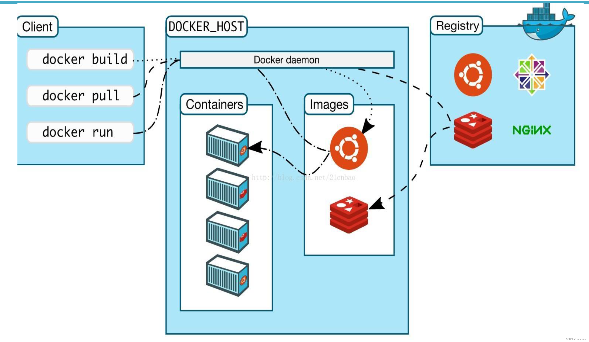

# Docker基本概念
Docker是容器化平台，提供了一种标准化的打包与运行程序的方式。
应用程序不再面向底层资源（物理机/虚拟机），而是通过docker引擎（这和java虚拟机的概念有点似曾相似）和底层资源打交道。

主要分成几个概念：docker CLI（类似MySQL中的客户端，通过命令和docker引擎打交道）。
docker server(其实就是docker host)。server端对外暴露了REST API（类似一个web服务器）

## 与传统虚拟化技术有何不同？
1、使用场景不同，虚拟化技术注重于物理隔离，将资源（CPU和内存）物理隔离开。容器则更注重于业务隔离。

2、虚拟化技术必须依赖于完整的操作系统，而使用Docker，只需要依赖于很轻量的操作系统就可以了，体积非常小。

## Docker架构

#### Docker架构是典型的C/S架构，和很多数据库采用的是一种架构。
服务端是docker host，基于docker daemon进程运行。对外暴露REST API风格的接口给外部调用。（其实可以理解为带了web服务器的功能)

#### Registry是什么？
其实就是中央仓库，java的maven，nodejs的npm都有中央仓库的概念。

#### Image是什么？
镜像是只读的文件集，有点像操作系统的安装光盘。提供了运行程序完整的软硬件资源，是应用程序的“集装箱”。

**镜像规范：一般为 \<domain\>/\<name\>:\<tags\>**

#### Container是什么？
容器则是基于镜像创建的运行实例。可以多次创建。容器之间彼此隔离。
